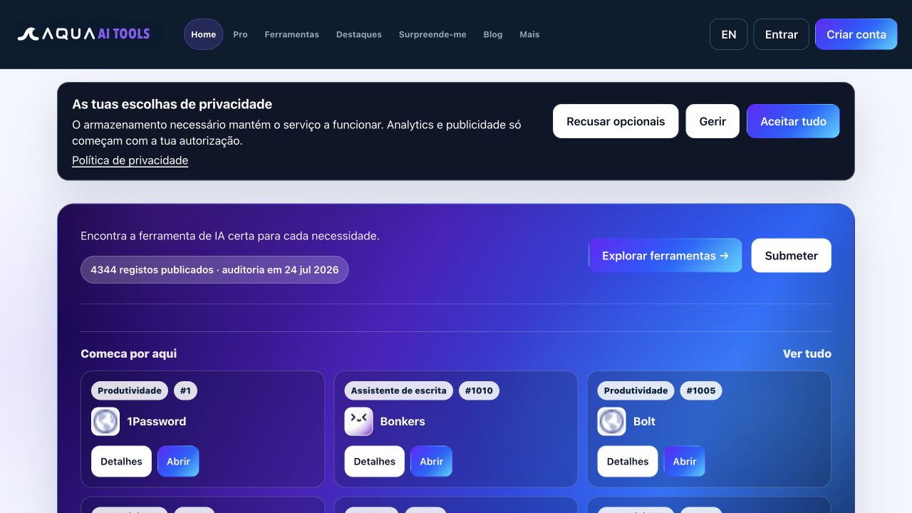

# Remediação de conteúdo AdSense — 13 de agosto de 2026

## Resultado

O principal risco de “conteúdo de baixo valor” não era a ausência de páginas legais ou de navegação. Era a relação entre a dimensão do catálogo e a quantidade de conteúdo editorial original por URL:

- 4.344 registos eram apresentados como páginas indexáveis;
- muitos detalhes continham apenas “Descrição editorial em revisão”, campos por verificar e alternativas igualmente incompletas;
- sete artigos curtos eram apresentados como leituras de 2–6 minutos;
- a publicidade era montada globalmente, incluindo rotas sem conteúdo editorial suficiente.

A remediação reduz a superfície indexável e concentra o valor editorial em páginas completas e verificáveis.

## Evidência visual

### 1. Entrada e proposta de valor — estado razoável

A homepage tem navegação clara, política de privacidade acessível, um H1 semântico e sinais de transparência. O principal problema é que o volume do catálogo domina a proposta de valor, enquanto o conteúdo original aparece pouco na primeira visita.

### 2. Página de ferramenta — estado crítico

Na inspeção publicada de `/ferramentas/1--1password`, o conteúdo visível incluía “Descrição editorial em revisão”, preço “Em revisão”, estado “Não verificado” e três alternativas com a mesma descrição provisória. A estrutura era utilizável, mas não oferecia análise editorial suficiente para justificar indexação ou anúncios.

### 3. Artigo — estado crítico

O artigo “Como avaliar uma ferramenta de IA em 15 minutos” tinha seis parágrafos curtos, apesar de apresentar três minutos de leitura. As ideias eram úteis, mas faltavam método detalhado, critérios, exemplo e autoria visível.

## Alterações implementadas

1. As páginas individuais do catálogo passaram para `noindex, follow` até terem uma avaliação manual substantiva.
2. As rotas `noindex` deixaram de montar o bloco de publicidade.
3. O blog passou de sete publicações breves para três guias editoriais completos em português e inglês.
4. Cada guia inclui autoria editorial, data de revisão, resumo, método passo a passo, checklists, regras de decisão e ligações para outros guias.
5. A homepage passou a destacar estes guias como parte central da proposta de valor.
6. A página Sobre explica a diferença entre um registo de catálogo e uma recomendação editorial.
7. O sitemap deixou de anunciar os quatro artigos removidos e atualizou as datas dos guias revistos.
8. Os dados estruturados dos guias passaram de `WebPage` genérica para `Article`, com autor e datas de publicação e revisão.

## Relação com as políticas da Google

A política de valor do inventário não permite anúncios em páginas sem conteúdo do editor, com conteúdo de baixo valor ou com conteúdo replicado sem comentário, curadoria ou valor adicional. A própria ajuda de reprovação pede texto suficiente, páginas concluídas e conteúdo original e relevante.

- [Google Publisher Policies — Inventory value](https://support.google.com/adsense/answer/10502938)
- [AdSense account wasn't approved — content quality](https://support.google.com/adsense/answer/81904)
- [Replicated content policy](https://support.google.com/publisherpolicies/answer/11190248)

## Verificação concluída

- build de produção Vite concluído;
- suite completa de smoke tests concluída;
- testes específicos confirmam artigos indexáveis, detalhes de ferramenta `noindex` e ausência de anúncios nessas rotas;
- conteúdo editorial mínimo protegido por teste: cinco secções e 500 palavras por idioma em cada guia.

## Limites e próximos passos antes de nova avaliação

A aprovação não pode ser garantida e depende também de fatores externos, como histórico do domínio, tráfego orgânico e avaliação da Google. Depois do deployment:

1. confirmar o HTML renderizado, metadados e layout em desktop e mobile;
2. enviar novamente o sitemap no Search Console;
3. pedir remoção/recrawl das páginas finas que já estejam indexadas;
4. publicar regularmente novos guias originais com experiência própria, testes datados e autoria;
5. esperar que a Google recrawle as alterações antes de pedir nova avaliação no AdSense.

## Limites da auditoria visual

A homepage publicada foi capturada e inspecionada. As páginas de ferramenta e artigo foram verificadas através do DOM visível da publicação. A captura visual pós-alteração ficou bloqueada pela indisponibilidade do servidor local no ambiente; o build e os testes automatizados concluíram sem falhas, mas o layout final deve ser confirmado depois do deployment.
