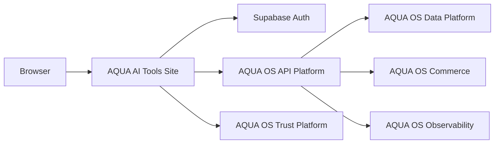

# Arquitetura do AQUA AI Tools Site

| Propriedade | Valor |
|---|---|
| Documento | Product Architecture |
| Categoria | Architecture |
| Responsável | AQUA Architecture |
| Versão | 1.0.0 |
| Estado | Review |
| Última atualização | 2026-07-18 |

## Objetivo

Definir a fronteira do produto e referenciar as capacidades canónicas do AQUA OS sem duplicar a respetiva documentação.

## Contexto

O produto é responsável pela experiência, composição e fachadas públicas. Identidade é validada no servidor. Dados, billing, trust, contratos API e observabilidade reutilizável pertencem ao AQUA OS.

## Regras arquitetónicas

- O browser nunca recebe service-role keys nem contacta Airtable, Stripe ou PostgreSQL diretamente.
- Identidade é derivada do bearer token; email enviado pelo cliente não é autoridade.
- As respostas JSON públicas seguem `{ data, meta: { traceId }, errors }`.
- Falhas de plataforma são fail closed; o produto não inventa dados ou entitlements.
- Decisões partilhadas são registadas nos ADR do AQUA OS.

## Referências canónicas

- AQUA OS `Services/APIPlatform`
- AQUA OS `Services/Commerce`
- AQUA OS `Services/DataPlatform`
- AQUA OS `Services/TrustPlatform`
- AQUA OS `Services/Observability`
- OpenAPI local: `docs/api-v1.openapi.yaml`
